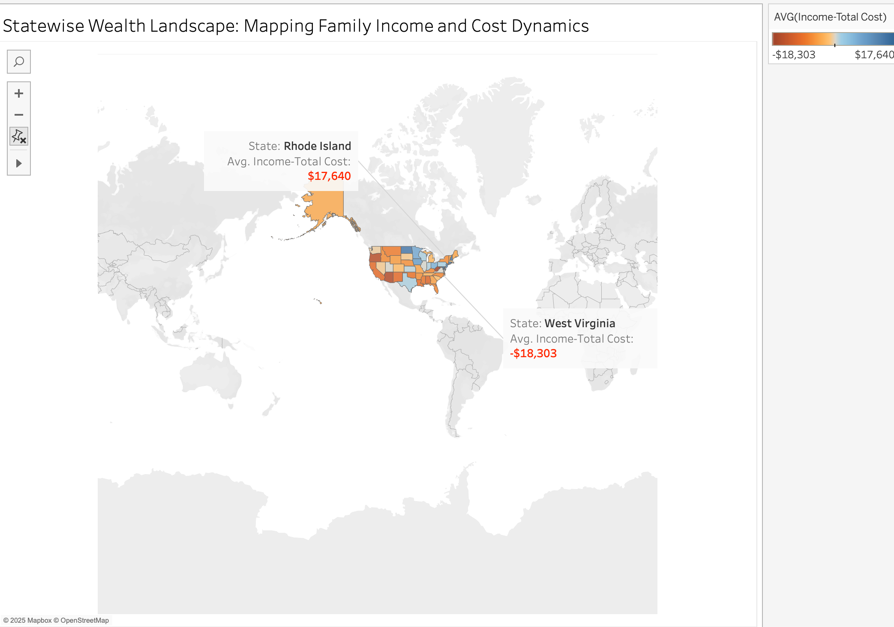
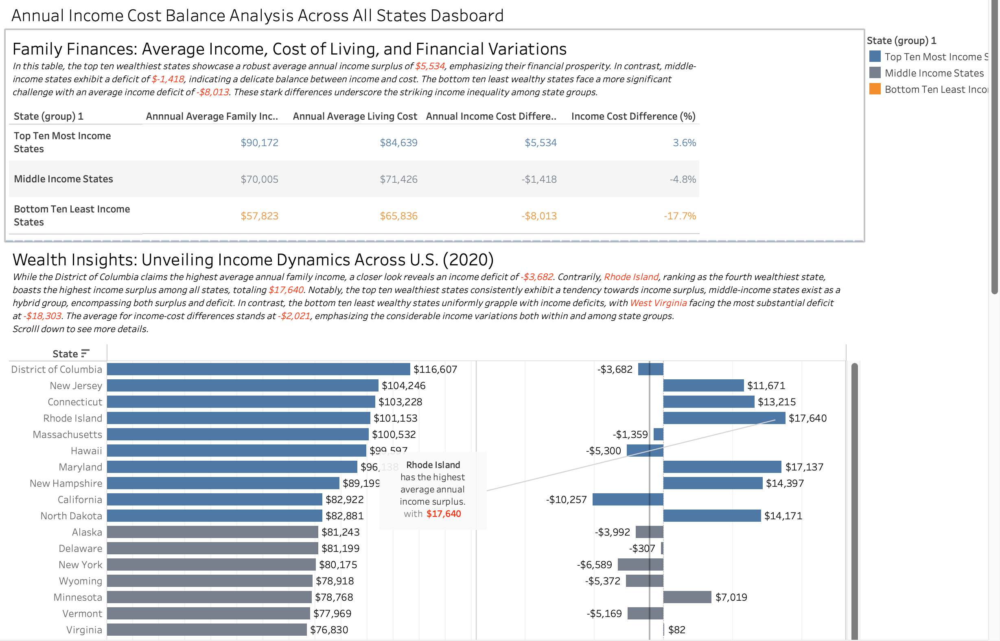
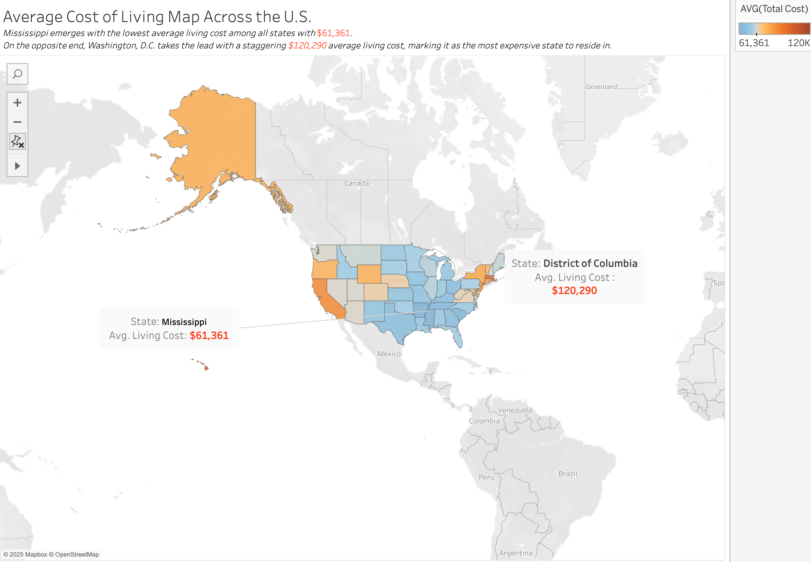
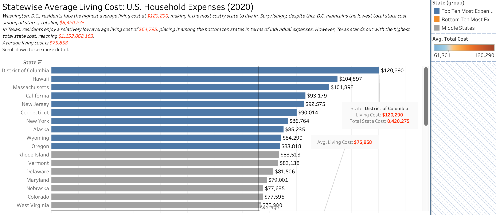

<b>US COST OF LIVING ANALYSIS</b>

<b>Overview:</b>  
This repository contains a comprehensive analysis titled “A Comprehensive Analysis of the Cost of Living in the United States (2020).” As part of the MIS 505 Data Visualization final project at the University of North Carolina, Wilmington, this project examines various cost-of-living metrics across U.S. states using 2020 data. The analysis focuses on household expenditure trends, income dynamics, and regional disparities, and includes interactive visualizations created with Tableau.

<b>Table of Contents:</b>  
• Overview  
• About the Data  
• Data Preprocessing  
• Visualizations and Analysis  
• Results  
• Files Included  
• How to Run / View the Project  
• Course Context  
• Contact  

<b>Overview:</b>  
This project investigates U.S. cost-of-living metrics from 2020. It explores key cost categories—housing, food, transportation, healthcare, childcare, other necessities, and taxes—as well as overall household expenditures and median family incomes. Detailed insights and visual comparisons help illustrate the financial landscape across states.

<b>About the Data:</b>  
The primary dataset, “Cost of Living in the United States (2020),” includes:  
• A unique case identifier (case_id)  
• State name (state) and other location details (areaname, county)  
• Household attributes (family_member_count)  
• Expense-related columns for housing, food, transportation, healthcare, childcare, other necessities, and taxes  
• The total aggregated cost (total_cost)  
• The median family income (median_family_income)  

Each row represents a unique case, providing the basis for detailed analysis of household expenses and income levels.

<b>Data Preprocessing:</b>  
The original dataset was provided in a wide format, with separate columns for each cost category. Using Python and the Pandas library, the data was reshaped into a long format by “melting” the individual cost columns into two unified columns: “Cost Type” and “Cost Value.” This reshaped dataset, saved as “cost_of_living_us(Reshaped).csv,” ensures consistency and streamlines analysis in Tableau.

<b>Visualizations and Analysis:</b>  
The project features a range of interactive visualizations that examine:  
• Total Annual Household Expenditure – A bar chart depicting overall U.S. household spending.  
• Distribution of Household Spendings – Dual-bar charts breaking down the contribution of each cost category.  
• Statewise Expenditure Analysis – Treemaps and maps illustrating expenditure differences across states.  
• Average Living Cost Analysis – Comparisons of cost-of-living metrics by state.  
• Income Dynamics – Visualizations highlighting average annual household incomes and income diversity.  
• Wealth and Cost Disparities – Comparative analyses of income surpluses and deficits by state.  

Each visualization provides both a visual critique and data-driven interpretation to reveal trends and regional financial disparities.

<b>Results:</b>

<b>Statewise Wealth Visualization</b>  

Interpretation:  
- Illustrates the differences between median family income and total living cost on a state-by-state basis.  
- Highlights regions with an income surplus (where incomes exceed living costs) versus those with an income deficit.  
- For example, states like Rhode Island exhibit a notable surplus, while states such as West Virginia show significant deficits.  
- Color coding and annotations make it easy to identify regional economic disparities.

<b>All States Dashboard</b>  

Interpretation:  
- Aggregates key cost-of-living metrics and household expenditure data for all states.  
- Offers a comprehensive overview that allows viewers to quickly compare overall spending—identifying high-expenditure states (e.g., Texas) versus those with lower spending (e.g., the District of Columbia).  
- Serves as a starting point for deeper exploration of regional financial patterns.

<b>Average Cost of Living Map Across the U.S.</b>  

Interpretation:  
- Depicts the average cost of living by state using a gradient color scale.  
- Darker hues indicate higher average costs (such as in Washington, D.C.), while lighter tones represent more affordable regions (e.g., Mississippi).  
- Clearly illustrates regional disparities in living costs, making geographic differences easily understandable.

<b>Statewise Average Living Cost</b>  

Interpretation:  
- Provides detailed average living cost information for each state, ranking them from most expensive to most affordable.  
- Helps identify specific states with high or low living expenses, offering insight into the financial pressures faced at the state level.  
- Facilitates direct comparisons of regional cost differences.

<b>Files Included:</b>  
• cost_of_living_us.csv – The original wide-format dataset.  
• cost_of_living_us(Reshaped).csv – The reshaped dataset for analysis.  
• Data Visualization-Final Project Cost of Living.twbx – The Tableau workbook with interactive visualizations.  
• Module 7- Data Visualizations Final Project.pdf – Detailed project documentation and design evaluation.

<b>How to Run / View the Project:</b>  
To explore the interactive visualizations:  
• Download and install Tableau Desktop or Tableau Public from https://www.tableau.com/.  
• Open the “Data Visualization-Final Project Cost of Living.twbx” file.  
• Use the interactive filters, tooltips, and actions to delve into various insights.  
For data review or to re-run preprocessing, refer to the provided CSV files.

<b>Course Context:</b>  
This project was developed for the MIS 505 Data Visualization course at the University of North Carolina, Wilmington. It demonstrates practical applications of data preprocessing, visualization design, and analytical evaluation to reveal economic trends and household cost disparities across the United States.

<b>Contact:</b>  
For any questions or feedback regarding the project, please contact:  
Bulut Tok  
Email: buluttok2013@gmail.com
